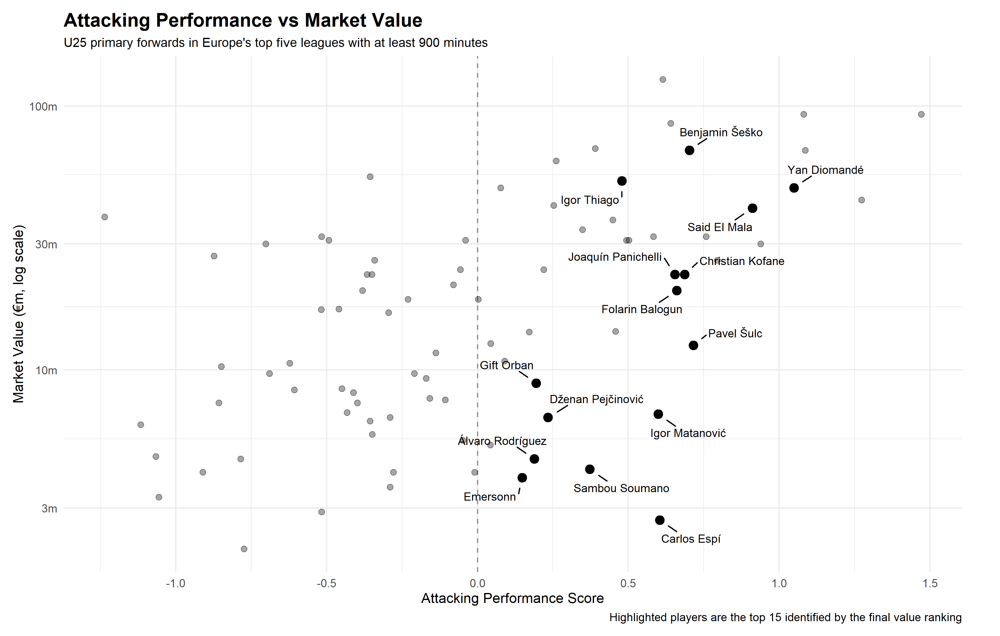
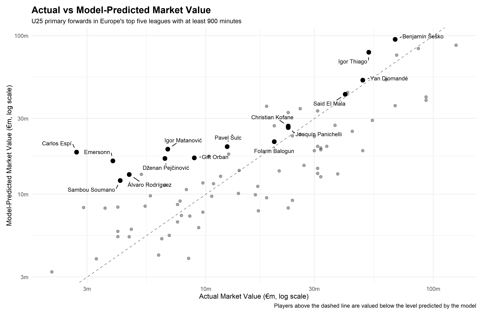
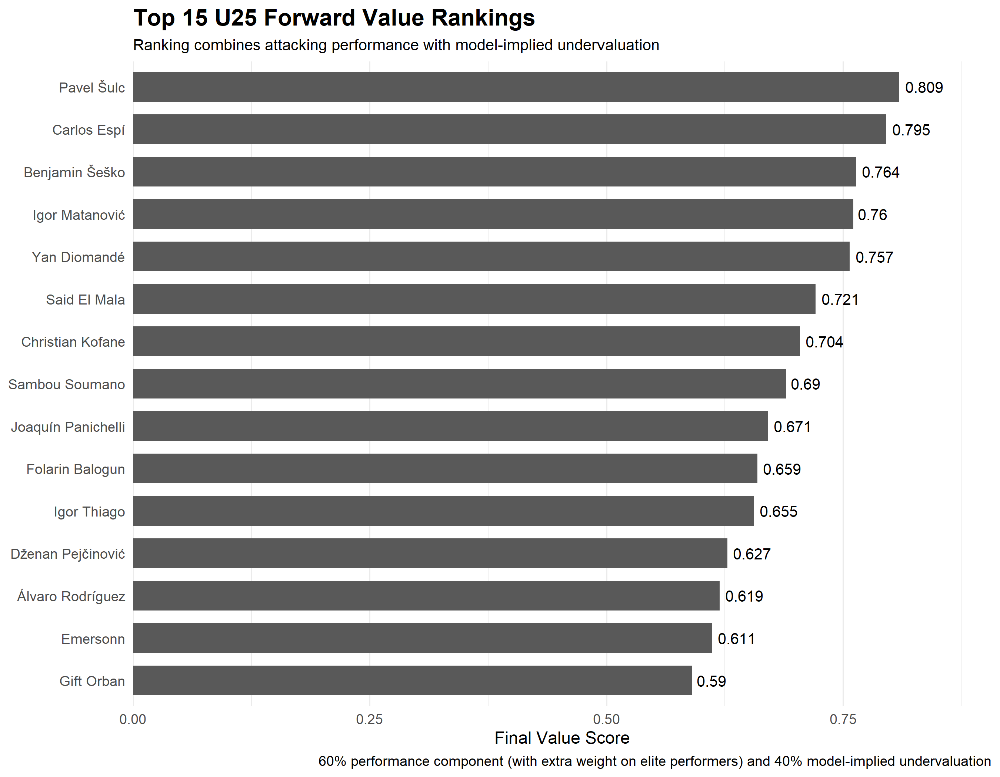

# U25 Forward Value Analysis

## Identifying Value Among U25 Forwards

Which U25 forwards in Europe’s top five leagues offer the strongest attacking performance relative to their market value?

That sounds simple, but there are two different things to consider. A player can be cheap without actually representing particularly good value, while an already expensive player could still look undervalued if their performances justify an even higher valuation.

I wanted to build a model that considered both sides. The aim was not to decide who a club should sign, but to narrow a large group of young forwards into players whose performances and current valuations made them worth looking at more closely.

## Building the Sample

The analysis uses full-season 2025/26 data from the Premier League, LaLiga, Bundesliga, Serie A and Ligue 1.

I restricted the sample to players under 25 who played at least 900 minutes. This removes players whose numbers were built on very small samples while still allowing younger players who were not necessarily guaranteed starters to be included.

I also limited the analysis to players whose primary position was listed as forward. Players classified as `FW` or `FW,MF` were included, while players listed as `MF,FW` were excluded.

This is useful for keeping the sample consistent, although it inevitably leaves out a few interesting players. Pablo Pagis, who recently earned a move to Paris FC is a good example. He was classified primarily as a midfielder and therefore falls outside the model, but his raw attacking numbers still make him someone I would want to look at separately. Cases like this are a useful reminder that a positional label should not completely replace actually looking at the player.

After matching the performance data to the market-value data and removing players without usable valuations, the final sample contained **85 players**.

## Measuring Attacking Performance

I did not want the performance ranking to simply become a list of the highest goalscorers.

Six attacking measures were used:

- Goals per 90
- Expected goals per 90
- Assists per 90
- Expected assists per 90
- Shots per 90
- Shot accuracy

Each metric was standardised relative to the other 84 players in the sample. They were then split into three areas: scoring, creation and shooting. **Scoring** combines goals and expected goals, **creation** combines assists and expected assists, while **shooting** combines shot volume and shot accuracy. The three components were weighted equally to produce one overall **Attacking Performance Score**.

Using expected as well as actual output is important here. Eleven goals can come from consistently getting into good shooting positions or from an unusually strong run of finishing. Including xG helps distinguish between the two, while the creation and shooting components prevent the score from being entirely centred around goals.

## Estimating Market Value

Once each player had an attacking performance score, I wanted to estimate what level of market value would normally be associated with that sort of profile.

I used a linear regression based on:

- Attacking Performance Score
- Age
- League
- Minutes played

Market value was log-transformed because football valuations are heavily skewed. Most players sit towards the lower end of the market, while a much smaller number are worth tens of millions more.

The model explained **62.5% of the variation in log market values**, meaning that performance, age, league and minutes together accounted for a substantial share of the differences in valuations across the sample. This should not be interpreted as 62.5% predictive accuracy, but it suggests the model captures a meaningful part of how players are valued.

The individual results were broadly intuitive. Better attacking performance was associated with higher valuations, while younger players tended to carry a premium within the U25 sample. The clearest league effect came from the **Premier League**, where comparable players carried substantially higher valuations. That is not particularly surprising given its financial strength and its reputation as one of the strongest and most competitive domestic leagues in world football.

I then used the regression as a benchmark rather than treating its estimate as a player's "true" value. The interesting players were those whose actual market value sat below what the model would normally expect from a similar profile.

## From undervaluation to a final ranking

There was one problem with simply ranking the regression residuals.

Some relatively weak performers looked heavily undervalued because their market values were particularly low. Mathematically that made sense, but it was not really what I wanted from a recruitment shortlist. Being cheap is not particularly useful if the attacking performance is not strong enough in the first place.

I therefore converted both attacking performance and model-implied undervaluation into percentile rankings and combined them into a final score:

**60% attacking performance + 40% model-implied undervaluation**

The performance percentile was squared before entering the score. This gives extra weight to players towards the top of the attacking distribution, rather than treating the difference between the 90th and 80th percentile in the same way as the difference between the 50th and 40th.

Only players whose actual value was below the level implied by the regression were eligible for the final shortlist.

The 60/40 split is ultimately a modelling choice, but I fixed it before looking at the final rankings rather than changing the weights afterwards to produce particular players.

## Results

### Performance and market value

The first graph shows the trade-off I was looking for. Players further to the right produced stronger attacking performances, while those lower down had lower market values. The most interesting area is therefore broadly towards the lower-right, where strong output meets a relatively low valuation.

Carlos Espí and Igor Matanović stand out immediately on that basis, while Pavel Šulc also combines strong attacking numbers with a much lower valuation than several players around him. At the other end, Yan Diomandé and Said El Mala were among the strongest performers in the entire sample, but already carried much higher market values.

This is useful as a first look, but price and performance alone do not tell the whole story. A €20m player in one league or at one age may not be directly comparable with a €20m player elsewhere, which is where the market-value model becomes more useful.

### Who looks undervalued?

The second graph compares each player's actual market value with the value implied by the regression. Players above the dashed line are valued below the level expected by the model, while players below it are valued above it.

Carlos Espí is the clearest example. His listed value is extremely low relative to what the model would expect from a player of his age, playing time and attacking output. Matanović, Šulc and several of the lower-cost forwards also sit noticeably above the line.

Importantly, though, being a long way above the line does not automatically make someone one of the strongest options. A player can look heavily undervalued partly because they are very cheap, even if their attacking performance is only average. That is why I did not use the regression residual alone for the final ranking.

### Bringing performance and value together

Once attacking performance and model-implied undervaluation are combined, **Pavel Šulc comes out on top**.

He scored 11 league goals in only 1,568 minutes and ranked around the 89th percentile for attacking performance, while his €12.4m market value remained well below the €23.4m level implied by the model. He did not rank first because of one particularly extreme metric, but because he performed strongly on both sides of the analysis.

**Carlos Espí finishes narrowly behind him** and is probably the most striking low-cost name in the results. At 20 years old he scored 11 goals in 1,350 minutes, around 0.73 goals per 90, while carrying a listed value of only €2.7m. The €21.6m model estimate should not be read as a literal transfer fee, but the size of the gap shows how unusual his combination of age, output and valuation was within the sample.

**Igor Matanović** offers a similar profile. He also scored 11 goals, doing so in 1,570 minutes, while being valued at €6.8m. Strong scoring and expected-goal numbers combined with that relatively low price pushed him to fourth overall.

The ranking also shows why this is not simply a bargain-hunting model. **Benjamin Šeško, Yan Diomandé and Said El Mala** already have high valuations, but their attacking output was strong enough for them to remain near the top. Diomandé scored 12 league goals and El Mala 13, despite both being only 18.

Further down, **Joaquín Panichelli scored 16 league goals**, while **Igor Thiago scored 22**, the highest total among the final top 15. Thiago was already valued at €52m, but his performance was strong enough for the model to still view that as relatively low compared with his profile.

The final ranking therefore contains a few different types of player. Some stand out because they combine strong output with a genuinely low valuation, while others are already expensive but still look relatively well priced given how well they performed.

## Final top 15

| Rank | Player | Age | League | Goals | Market Value | Model Value |
|---|---|---:|---|---:|---:|---:|
| 1 | Pavel Šulc | 24 | Ligue 1 | 11 | €12.4m | €23.4m |
| 2 | Carlos Espí | 20 | LaLiga | 11 | €2.7m | €21.6m |
| 3 | Benjamin Šeško | 22 | Premier League | 11 | €68.0m | €111.1m |
| 4 | Igor Matanović | 22 | Bundesliga | 11 | €6.8m | €22.6m |
| 5 | Yan Diomandé | 18 | Bundesliga | 12 | €49.0m | €61.5m |
| 6 | Said El Mala | 18 | Bundesliga | 13 | €41.0m | €50.0m |
| 7 | Christian Kofane | 19 | Bundesliga | 5 | €23.0m | €31.5m |
| 8 | Sambou Soumano | 24 | Ligue 1 | 4 | €4.2m | €14.3m |
| 9 | Joaquín Panichelli | 22 | Ligue 1 | 16 | €23.0m | €30.8m |
| 10 | Folarin Balogun | 24 | Ligue 1 | 13 | €20.0m | €25.1m |
| 11 | Igor Thiago | 24 | Premier League | 22 | €52.0m | €92.2m |
| 12 | Dženan Pejčinović | 20 | Bundesliga | 8 | €6.6m | €19.7m |
| 13 | Álvaro Rodríguez | 21 | LaLiga | 7 | €4.6m | €15.6m |
| 14 | Emersonn | 21 | Ligue 1 | 6 | €3.9m | €19.0m |
| 15 | Gift Orban | 23 | Serie A | 7 | €8.9m | €19.9m |

The model values shown here are best treated as reference points rather than suggested transfer fees. Their purpose is to show the level at which the regression would expect a player with that profile to be valued.

## How does it compare with the real market?

A useful final check is whether some of the players highlighted by the model have also started attracting greater attention in the real transfer market.

**[Add examples here of players from the analysis who later earned significant moves, attracted major interest or saw their valuations rise.]**

I would not treat that as proof that the model has correctly predicted their careers. Clubs have access to far more information than is included here and transfers depend on factors such as contracts, tactical fit, negotiations and the needs of individual teams.

Still, if players highlighted by a relatively simple data model are also beginning to attract stronger interest in the real market, it gives some reassurance that the analysis is picking up genuine signals rather than producing a completely artificial ranking.

## Limitations

The biggest limitation is the market-value data itself.

Market values are estimates rather than actual transfer prices. A player listed at €15m might eventually move for substantially more or less depending on their contract situation, the finances of the selling club, the number of interested buyers and how willing that club is to sell. The model is therefore partly explaining how players are valued by the data provider rather than directly estimating what another club would actually have to pay.

This is particularly important when looking at large gaps between actual and model-implied values. Carlos Espí's €21.6m model estimate, for example, should not be interpreted as evidence that he could definitely be sold for that amount. It is much more useful as an indication that his €2.7m listed value looks unusually low relative to the rest of the sample.

The timing of the valuations is another limitation. The performance data covers the full 2025/26 season, while the market values come from a separate dataset snapshot, so the two do not necessarily represent exactly the same point in time.

The positional filter is deliberately strict as well. Limiting the sample to players listed primarily as forwards keeps the comparison cleaner, but it inevitably leaves out some interesting attackers. **Pablo Pagis at Paris FC** is one example. His `MF,FW` classification excludes him from the model, despite his raw attacking numbers making him someone I would still want to investigate separately. Players like that are a good reminder that a positional label should not completely replace looking at the underlying data.

There is also a lot the model does not know. Contract length, wages, injuries, physical attributes, defensive contribution, pressing, tactical role and suitability for a particular team can all materially affect how attractive a player actually is.

Team context is another factor. A forward playing for a dominant side may naturally receive more chances and spend far more time around the opposition penalty area than someone playing for a weaker team.

Finally, the **60/40 weighting** is a modelling choice rather than an objectively correct formula. I chose it because I wanted attacking performance to matter more than simply being cheap. A different analyst could reasonably place more or less emphasis on either side.

## Final thoughts - From data to recruitment

This is still a relatively simple analysis of young forwards. It uses a limited set of attacking metrics and cannot capture everything that determines whether a player will succeed at a new club. Even so, it provides a useful foundation for identifying players worth investigating further.

The subsequent transfer market provides some support for that. Several players highlighted by the analysis went on to earn major moves, attract substantial bids or receive increased interest from leading European clubs. That does not mean the model predicted those transfers, but it suggests that some of the same underlying performances identified here were also being noticed in the wider recruitment market.

There is also plenty of scope to take the analysis further. Adding more detailed attacking metrics — such as progressive carries, touches in the penalty area, shot-creating actions, pressing data and measures of chance quality — could give a much fuller picture of each player's style and potentially improve how closely the model reflects the way clubs evaluate young forwards.

Ultimately, though, the data should be the starting point rather than the final decision. Once a shortlist has been created, the next step is to understand the context behind the numbers. Would the player suit the tactical system of the club recruiting them? Do they have the work rate and attitude required? Are their numbers sustainable, or were they produced by one unusually strong season? And, most importantly, is there evidence that the player can continue developing rather than having already reached their current level?

That is where scouting and data analysis work best together. Statistics can reduce a large pool of players to a much more manageable shortlist and highlight names that might otherwise be overlooked. From there, detailed scouting can determine whether the numbers represent a genuine recruitment opportunity — or simply an impressive season.

## Data and code

Full-season performance data was taken from the [Top 5 Football Dataset](https://github.com/m-mahadi/top5-football-dataset), with SofaScore metrics used consistently for the attacking analysis.

Market values came from a separate SofaScore-derived player profile dataset.

The analysis was completed in **R**, with **ggplot2** and **ggrepel** used for the visualisations. The full R script and final ranking data are included in this repository.

